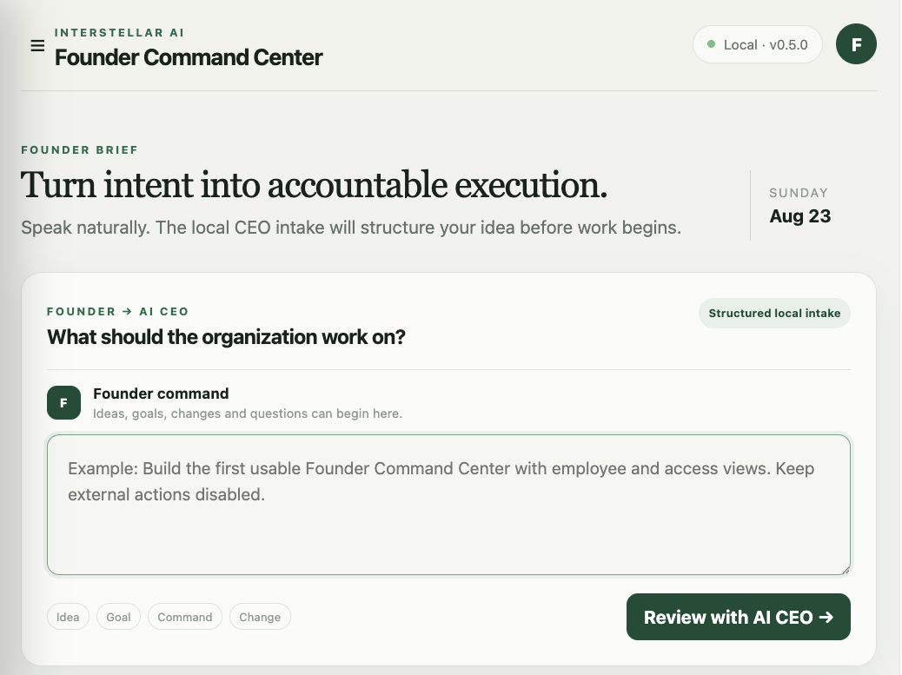

# AI Organization OS MVP

This is a runnable first version of an AI Organization OS. It validates the smallest goal-driven organization loop:

```text
Founder intent → work classification → employee routing → approved executor → evidence → review
```



AI Organization OS is available under the [Apache License 2.0](LICENSE). See the [2–3 minute demo walkthrough](docs/DEMO.md) for a concise tour of the Founder console, permission model, general work routing, and protected Codex execution.

Product documentation, project notes, operating rules, canonical addresses, and upload requirements are indexed in [`docs/PROJECT_KNOWLEDGE.md`](docs/PROJECT_KNOWLEDGE.md) and [`AGENTS.md`](AGENTS.md).

## Quick start

```bash
npm start
```

Open <http://localhost:3333>. On first launch, the server creates an example AI organization, classified assets, access policies, and one safety-policy memory. Runtime data is stored in `data/state.json`.

To enable Codex-powered coding tasks, install the [Codex CLI](https://learn.chatgpt.com/docs/codex/cli) and sign in with ChatGPT:

```bash
npm install -g @openai/codex
codex login
```

The Projects page accepts general Founder work requests across product, research, design, software, content, sales, operations, and general work. The MVP classifies and routes every request to an appropriate employee. Software development can continue into protected Codex execution; other work types remain honestly `blocked` until their approved executors are connected.

Run the test suite with:

```bash
npm test
```

## Contributing

Contributions are welcome. Read [`CONTRIBUTING.md`](CONTRIBUTING.md) before opening an issue or pull request. Never include credentials, personal data, local paths, or runtime state in public contributions.

## MVP API

| Capability | Endpoint |
| --- | --- |
| Health check | `GET /api/health` |
| Agent management | `GET/POST /api/agents` |
| Job templates | `GET/POST /api/job-templates` |
| Preview a template-based hire | `POST /api/job-templates/preview` |
| Goal input | `GET/POST /api/goals` |
| Generate a plan | `POST /api/goals/:id/plan` |
| Replan a goal | `POST /api/goals/:id/replan` |
| Goal progress and evidence | `GET /api/goals/:id/summary` |
| Task management/execution | `GET/POST /api/tasks`, `POST /api/tasks/:id/run` |
| Classify and route a Founder work request | `POST /api/work-requests` |
| Codex runtime status | `GET /api/codex/status` |
| Create a protected coding task | `POST /api/coding/tasks` |
| Basic memory | `GET /api/memories?q=...`, `POST /api/memories` |
| Tool registry | `GET /api/tools`, `POST /api/tools/execute` |
| Audit events | `GET /api/events` |
| Asset registry | `GET/POST /api/assets` |
| Authorized asset catalog | `GET /api/assets/catalog?agentId=...&q=...` |
| Access policies | `GET/POST /api/policies` |
| Preview policy impact | `POST /api/policies/preview` |
| Effective employee access | `GET /api/access/effective?agentId=...&assetId=...` |
| Access requests | `GET/POST /api/access-requests` |
| Approve or reject access | `POST /api/access-requests/:id/decision` |
| Consume authorized access | `POST /api/access/consume` |

The current tool set includes `goal.analyze`, `solution.design`, `mvp.inspect`, `workflow.validate`, `iteration.record`, `memory.search`, `memory.write`, `task.list`, `goal.list`, `asset.catalog`, `asset.inspect`, `code.codex`, and `echo`. Tools are registered on an allowlist, and unregistered tools are rejected. Every planned task must produce evidence before it can become `completed`.

## Current boundaries

- The scheduler checks every second for pending tasks whose dependencies are complete, then executes them by priority.
- Goal workflows use local deterministic tools that produce structured outputs and evidence. Founder work requests without a connected executor remain `blocked` instead of being falsely completed.
- Plan generation currently uses a fixed five-stage template and does not call an LLM.
- JSON storage is suitable for a single-machine MVP, but not for multi-process or high-concurrency workloads.
- Access requests and local approval decisions are implemented, but high-impact external actions do not yet have connectors or an execution approval gate.
- One-use grants are consumed only when an executor calls the controlled access endpoint. Time-bound grants expire automatically, but no external connector uses them yet.
- Job templates provide role inheritance. Project-scoped access remains deferred until the separate Project domain is implemented.
- The Employees page can hire an employee from a job template after previewing inherited responsibilities, capabilities, matching policies, and default access. Role defaults are copied at hire time; template editing and employee overrides are not yet exposed.
- Protected tools require employee identity, an active assigned task, a non-expired task capability, and an allowed access-policy decision. The authorized asset catalog hides assets outside the employee's allowed or requestable policy scope.
- `code.codex` requires `read`, `modify`, and `execute` permission on the assigned source-code asset before Codex starts. Each run uses a detached local Git worktree, the `workspace-write` Codex sandbox, a sanitized child-process environment, bounded output, and a timeout.
- Codex coding tasks cannot push, merge or deploy through this executor. The current version records changed files and execution evidence, but does not yet provide a Founder review-and-apply workflow or automatic worktree cleanup.
- The current HTTP API is still a trusted single-Founder development surface without authentication. A production deployment must derive employee and task identity from signed runtime credentials rather than request fields.

## Iteration roadmap

1. **v0.4: Access governance foundation** — Persistent job templates, policy impact preview, approval-required rules, temporary grants, authorized asset discovery, task capabilities, and enforced protected-tool checks.
2. **v0.5: Codex-first coding executor** — Add protected Codex work orders, isolated Git worktrees, runtime health, evidence, and a Founder-facing assignment form.
3. **v0.6: Model decision and reliable execution layer** — Add an LLM-backed Goal Planner, Agent Router, structured-output validation, SQLite/Postgres, queues, idempotency, cancellation, retries, and execution approval gates.
4. **v0.7: Connector layer** — Add browser, GitHub, email, CRM, and cloud-service connectors with scoped permissions.
5. **v0.8: Organizational learning layer** — Add task evaluation, tiered long-term memory, knowledge retrieval, agent performance, and cost monitoring.
6. **v1.0: Multi-tenant edition** — Add user/team permissions, secret management, isolated execution environments, budget controls, compliance, and observability.

The confirmed first scenario is an AI Software Product Studio. The next implementation step is to replace the fixed five-stage template with its product, project, design, engineering, test, review, and Founder-acceptance workflow.
